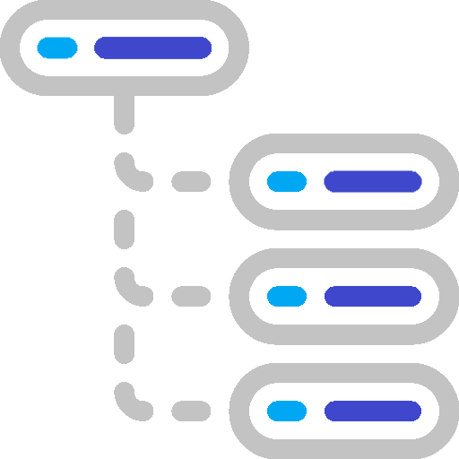

    

<h1> CDD </h1>

CDD is a simple and easy to use tool that allows you to easily move to a different directory without having to type the full path. For example, `cd C:\Users\John\Documents\Photos\2020\Summer\` could become `cdd summer_2020`.
 
 

## Installation

Download `cdd.bat`, and either place it in `C:\Windows\System32\` or add the folder where it is placed to you `PATH` environment variable.

## Usage
`cdd -a [NAME] [PATH]` will add a new path that can be used with `cdd [NAME]`. This will overwrite any existing path with the same name.

`cdd -d [NAME]` will delete the path with the given name.

`cdd [NAME]` will change the current directory to the path with the given name.

If a `run.bat` file is present in the directory that is being changed to, it will be executed. This will allow you to automatically start the program when you change directories if desired.

`cdd [NAME] -r` will change the current directory to the path with the given name, but wont run the `run.bat` file, even if it is present.
